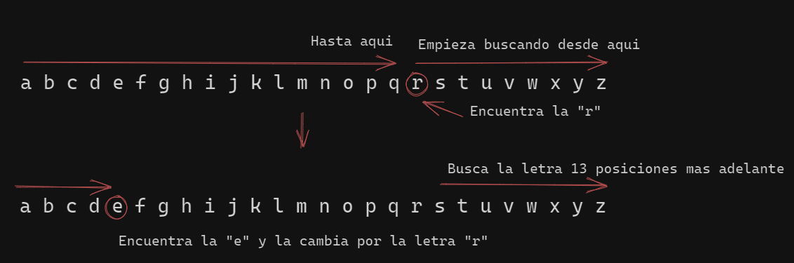

- - -

Ejercicio de OverTheWire visto en Hack4u

### Origen e historia

El gobernante romano *Julio César* (100 a. C. – 44 a. C.) utilizó un **cifrado muy simple** para la **comunicación secreta**. Sustituyó cada letra del alfabeto con una letra **tres posiciones más adelante**. Más tarde, cualquier cifrado que utilizara este concepto de «desplazamiento» para la creación de un alfabeto cifrado, se denominó cifrado César.

En el siglo XIX, la sección de anuncios personales en los periódicos a veces se usaba para intercambiar mensajes encriptados usando esquemas de cifrado simples. *Kahn* (1967) describe casos de amantes que participan en comunicaciones secretas cifradas utilizando el cifrado César en *The Times*.

Incluso ya en 1915, el cifrado César estaba en uso: el ejército ruso lo empleó como reemplazo de cifrados más complicados que habían resultado demasiado difíciles de dominar por sus tropas. Los criptoanalistas alemanes y austriacos tuvieron pocas dificultades para descifrar sus mensajes.

De todos los cifrados de tipo de sustitución, este cifrado de César **es el más simple de resolver**, ya que **solo hay 25 combinaciones** posibles.


### Rot13

Tipo de **cifrado César** (*rotar 13 posiciones*) que sustituye cada letra por la que este 13 posiciones por delante en el alfabeto

Existe una tabla de búsqueda para este cifrado:

| ABCDEFGHIJKLMNOPQRSTUVWXYZabcdefghijklmnopqrstuvwxyz |
| ------------------------------------------------------------------------ |
| **NOPQRSTUVWXYZABCDEFGHIJKLMnopqrstuvwxyzabcdefghijklm** |

Como curiosidad, **dos iteraciones** de ROT13 **recuperan el texto** original, en matemáticas se conoce como *involución* o *función involutiva*

- - -

### Función ROT13 con TR

Tenemos un fichero **data.txt** con una cadena codificada con **ROT13**

```bash
data.txt
```

Para aplicar la función ROT13 de nuevo y recuperar el texto original

```bash
cat data.txt | tr '[A-Za-z]' '[N-ZA-Mn-za-m]'
```

##### Ejemplo practico

Si tenemos el string:

	ry rkgebiregvqb zven ybf mncngbf

Que corresponde a:

	el extrovertido mira los zapatos

tendremos que aplicar la función así:

```bash
echo "ry rkgebiregvqb zven ybf mncngbf" | tr '[R-ZA-Qr-za-q]' '[E-ZA-De-za-d]'
```

Desglosando esto, tenemos un **string en rot13** y le aplicamos el **tr** para que busque caracteres desde la primera letra que vemos ( **r** ) hasta la ultima del abecedario y desde la primera letra del abecedario hasta la letra anterior a la que habíamos delimitado ( **q** ) y las sustituya por el rango de letras que están 13 posiciones por delante

Si lo vemos iteración por iteración, empezando por la **r** seria algo así:

[](./2023-06-21-Cifrado-cesar-tr.md)

Pero como es **rot13** si aplicamos la misma codificación obtendremos el string en claro:

```bash
echo "ry rkgebiregvqb zven ybf mncngbf" | tr '[A-Za-z]' '[N-ZA-Mn-az-m]'
```


